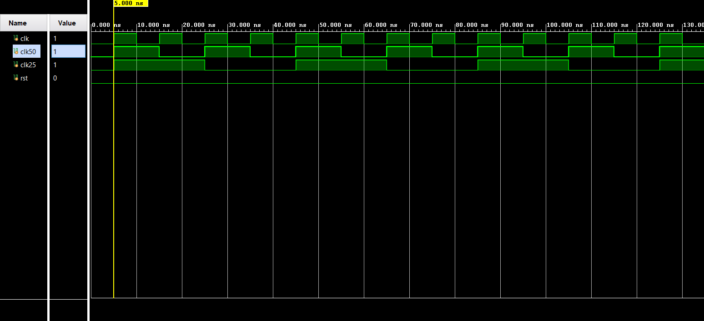

# 🧪 SystemVerilog Practice — Daily Tasks & Testbenches


---

### About This Repo

This repository contains my **day-to-day SystemVerilog practice** tasks, testbenches and experiments as I progress through learning SV for VLSI verification. Each folder represents a topic and each file is a small focused task.

> 🔄 New tasks added regularly as I learn!

---

### 📁 Folder Structure

```
systemverilog-practice/
├── 📁 clocking/
│     ├── 01_clock_gen_alignment.sv    ← 100/50/25 MHz clock alignment ✅
│     └── waveform_01.png              ← Simulation waveform ✅
├── 📁 data_types/
│     └── (coming soon)
├── 📁 testbench/
│     └── (coming soon)
├── 📁 assertions/
│     └── (coming soon)
├── 📁 randomization/
│     └── (coming soon)
└── README.md
```

---

### 📝 Tasks Log

| # | Task | Topic | Status |
|---|------|-------|--------|
| 01 | Clock Generation & Edge Alignment | Clocking | ✅ Done |
| 02 | Data Types & Default Values | data_types | ✅ Done |

---

### 📌 Task 01 — Clock Generation & Edge Alignment

**File:** `clocking/01_clock_gen_alignment.sv`
**Waveform:** `clocking/waveform_01.png`

Created a SystemVerilog testbench generating **3 clocks** with rising edges aligned at simulation start:

| Signal | Frequency | Period | Method |
|--------|-----------|--------|--------|
| clk | 100 MHz | 10 ns | `always #5` toggle |
| clk50 | 50 MHz | 20 ns | always — manual high/low timing |
| clk25 | 25 MHz | 40 ns | always — manual high/low timing |
| rst | — | — | active-low reset |

**Key Concepts Used:**
- ✅ `` `timescale `` directive (1ns / 1ps)
- ✅ `initial` block for signal initialization
- ✅ `always` block for continuous clock generation
- ✅ Manual high/low timing for precise edge alignment
- ✅ `$dumpfile` & `$dumpvars` for waveform capture
- ✅ `$finish` for simulation control (200ns total run)

**Waveform Output:**



> Waveform showing clk (100MHz), clk50 (50MHz), clk25 (25MHz) and rst — all rising edges aligned at simulation start.

---

### 📌 Task 02 — Data Types & Default Values

**File:** `data_types/01_data_types.sv`

Explored default values of different SystemVerilog data types
without any assignment to understand their initial state.

| Type | Default Value | State |
|------|--------------|-------|
| reg | X (unknown) | 4-state |
| logic | X (unknown) | 4-state |
| bit | 0 | 2-state |
| byte | 0 | 2-state |
| int | 0 | 2-state |

**Key Learning:** 4-state types (reg, logic) default to **X**
while 2-state types (bit, byte, int) default to **0**

### 🎯 Learning Goals

- [x] Clock generation & edge alignment
- [ ] SystemVerilog Data Types & Variables
- [ ] Arrays, Queues & Associative Arrays
- [ ] Clocking Blocks & Interfaces
- [ ] OOP — Classes, Inheritance, Polymorphism
- [ ] Assertions (SVA — SystemVerilog Assertions)
- [ ] Randomization & Constraints
- [ ] Testbench Components — Driver, Monitor, Scoreboard

---

### 🛠 Tools Used

| Tool | Purpose |
|------|---------|
| Xilinx Vivado | Simulation & Waveform Analysis |
| SystemVerilog | Hardware Verification Language |

---

### 👨‍💻 Author

**Arshad Ansari**
M.Tech ECE (VLSI Design) — NIT Hamirpur
[](https://www.linkedin.com/in/arshadansari04/)
    
